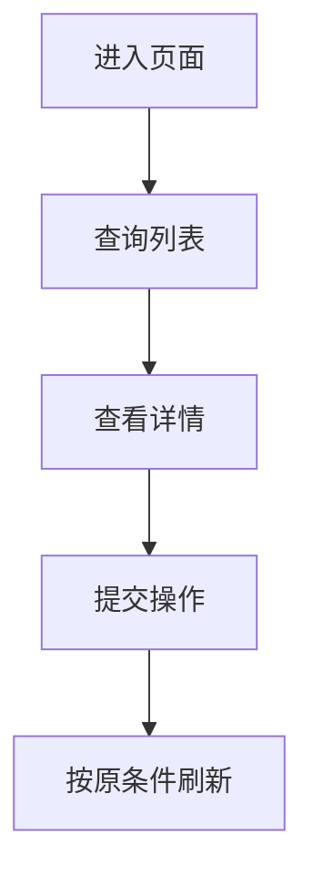

# <模块名>接口文档

## 1. 文档概览

| 项 | 内容 |
| --- | --- |
| 当前版本 | `v1.0.0` |
| 更新日期 | `YYYY-MM-DD` |
| 代码范围 |  |
| Base path |  |
| 适用页面或业务 |  |

本文档描述当前代码实际接口行为。环境域名、测试账号或外部系统口径无法从代码确认时，统一放在“待确认项”。

## 2. 本版变更摘要

初版文档可以删除本节。

| 类型 | 接口或字段 | 变化 | 兼容性 | 前端动作 |
| --- | --- | --- | --- | --- |
| 新增 |  |  | 兼容 |  |
| 修改 |  |  | 兼容 / 破坏性 |  |
| 删除 |  |  | 破坏性 |  |

## 3. 前端快速开始

### 3.1 通用请求

| 项 | 约定 |
| --- | --- |
| 鉴权 |  |
| Content-Type |  |
| Base path |  |
| 分页 |  |
| 时间格式 |  |
| 空值约定 |  |

### 3.2 通用响应

```json
{
  "code": 200,
  "msg": "操作成功",
  "data": {}
}
```

| 字段 | 类型 | 可空 | 说明 |
| --- | --- | --- | --- |
| `code` | integer | 否 | 业务处理结果 |
| `msg` | string | 是 | 提示信息 |
| `data` | object | 是 | 业务数据 |

分页接口示例：

```json
{
  "code": 200,
  "msg": "查询成功",
  "total": 1,
  "rows": []
}
```

只保留项目真实使用的包装结构，删除不适用示例。

### 3.3 推荐调用顺序

1. `<第一步>`
2. `<第二步>`
3. `<第三步>`

## 4. 页面或业务流程

### 4.1 <流程名称>

目标：

前置条件：

流程说明：

1. `<第一步>`
2. `<第二步>`
3. `<第三步>`

存在依赖、分支、异步或跨模块交互时补图：



关键字段传递：

| 上游动作或接口 | 产出字段 | 下游接口 | 使用方式 |
| --- | --- | --- | --- |
|  |  |  |  |

失败处理：

- `<失败场景及处理方式>`

## 5. 接口清单

按页面或业务任务排序。

| 顺序 | 接口 | Method | Path | 页面用途 | 请求 | 返回 |
| --- | --- | --- | --- | --- | --- | --- |
| 1 |  |  |  |  |  |  |

## 6. 接口详情

### 6.1 <接口名称>

#### 用途与调用时机

说明页面在什么动作下调用，以及成功后做什么。

#### 请求

| 项 | 内容 |
| --- | --- |
| Method | `GET` |
| Path | `/example/{id}` |
| Content-Type | 见通用约定；有特殊格式时填写 |

参数：

| 字段 | 位置 | 类型 | 必填 | 默认值 | 约束 | 示例 | 说明 |
| --- | --- | --- | --- | --- | --- | --- | --- |
| `id` | path | integer | 是 | - | 正整数 | `1001` | 主键 |

没有某类参数时直接省略，不需要创建空的 Header、Path、Query、Body 小节。

请求示例：

```http
GET /example/1001
Authorization: Bearer <token>
```

有 JSON 请求体时：

```json
{
  "name": "示例"
}
```

#### 成功响应

```json
{
  "code": 200,
  "msg": "操作成功",
  "data": {
    "id": 1001,
    "name": "示例"
  }
}
```

业务返回字段：

| 字段 | 类型 | 可空 | 示例 | 说明或枚举 |
| --- | --- | --- | --- | --- |
| `data.id` | integer | 否 | `1001` | 主键 |
| `data.name` | string | 否 | `示例` | 名称 |

列表、详情、分页或文件流按接口真实结构展开。通用包装已经在前文说明时，不必在每个接口重复列 `code/msg`。

#### 业务规则与边界

- `<业务规则或边界>`
- `<业务规则或边界>`

#### 前端需要处理的错误

只写当前代码真实存在且前端能够采取动作的错误。

| 业务码或消息 | 触发条件 | 前端处理 |
| --- | --- | --- |
|  |  |  |

公共登录失效、无权限和服务端异常已在全局统一处理时，不要在每个接口重复。

## 7. 枚举与公共字典

| 字段 | 值 | 含义 | 使用接口 |
| --- | --- | --- | --- |
| `status` | `0` | 停用 |  |
| `status` | `1` | 启用 |  |

条件规则：

- 当 `<字段>=<值>` 时，`<字段>` 必填。

## 8. 后端问题与联调风险

这里记录当前代码问题，不把它们伪装成稳定契约。

| 问题 | 当前行为 | 前端影响 | 建议处理 | 是否阻塞 |
| --- | --- | --- | --- | --- |
|  |  |  |  | 是 / 否 |

## 9. 待确认项

只记录无法从当前代码确认的外部或业务事项，例如：

- 环境域名和网关前缀。
- 测试账号和测试数据。
- 外部系统的真实返回。
- 尚未确定的业务文案。

## 10. 版本记录

| 版本 | 日期 | 变化范围 | 兼容性 | 前端动作 |
| --- | --- | --- | --- | --- |
| `v1.0.0` | `YYYY-MM-DD` | 初版 | - | 按本文档接入 |
