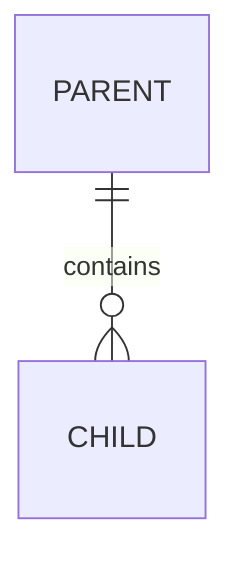

# 数据文档：<模块名>

## 数据对象

| 对象 | 业务含义 | 来源 | 生命周期 |
| --- | --- | --- | --- |
|  |  |  |  |

## 关键字段

只记录影响业务逻辑、权限、状态、关联和兼容性的字段。

| 对象.字段 | 类型 | 含义 | 来源或生成规则 | 约束 |
| --- | --- | --- | --- | --- |
|  |  |  |  |  |

## 数据关系

复杂关系再保留 ER 图；简单关系使用自然语言或表格。

## 写入、更新与快照规则

## 删除、归档与历史保留

## 权限、一致性与唯一性

## 关联规则和流程

## 风险与未确认项
