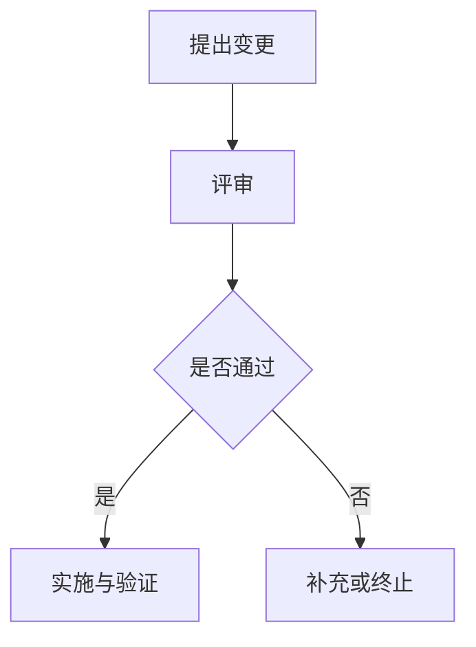

# 团队变更流程：<流程名>

> 仅当项目存在区别于通用文档工作流的真实审批、测试、发布或协作流程时使用。不要在这里复制 AI 的通用文档维护规则。

## 目标与适用范围

## 参与角色

| 角色 | 职责 |
| --- | --- |
|  |  |

## 触发条件与前置输入

## 团队流程

1. `<真实团队步骤>`

存在角色交互、审批分支或异步等待时再补图：

## 审批与门禁

| 阶段 | 责任角色 | 输入 | 通过条件 | 输出 |
| --- | --- | --- | --- | --- |
|  |  |  |  |  |

## 失败、回退与升级路径

## 项目特有的文档同步要求

仅记录本项目额外要求，不复制 `project-docs-workflow` 的通用规则。

## 关联文档

- 功能：
- 测试：
- 发布：
- ADR：
