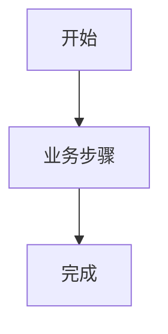

# 流程文档：<流程名>

## 目标

用自然语言说明用户或系统要完成什么。

## 参与者与前置条件

## 主流程

1. `<业务步骤>`

## 流程图

流程简单时删除本节。存在三步以上依赖、分支、异步或跨模块交互时选择合适 Mermaid 图。

## 分支与失败路径

| 条件 | 系统行为 | 用户或调用方结果 | 关联规则 |
| --- | --- | --- | --- |
|  |  |  |  |

## 状态与不变量

## 数据传递

| 上游 | 数据 | 下游 | 转换或约束 |
| --- | --- | --- | --- |
|  |  |  |  |

## 实现映射

| 规则 ID | 接口、模块或组件 |
| --- | --- |
|  |  |

## 关联文档

- 功能：
- API 摘要：
- 数据：
- 测试：
- 实施记录：

## 未确认项
